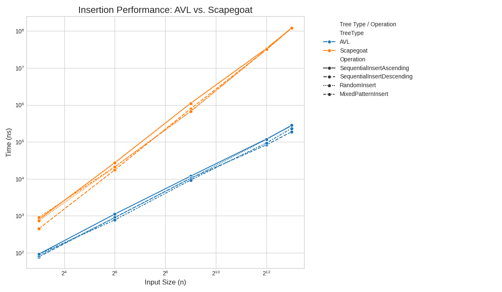
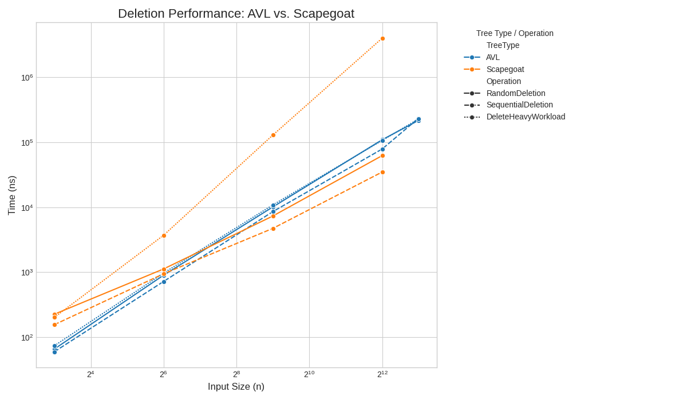
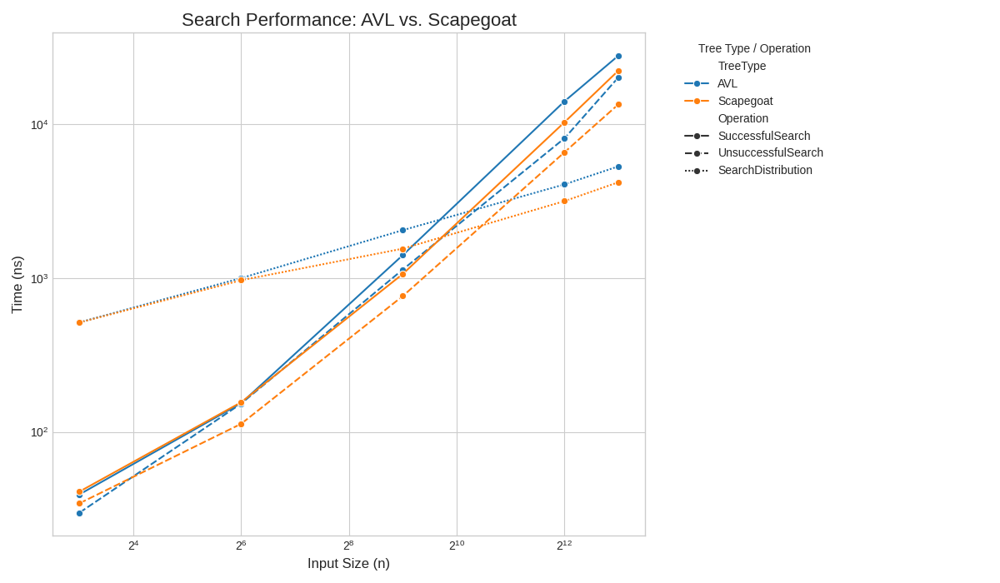
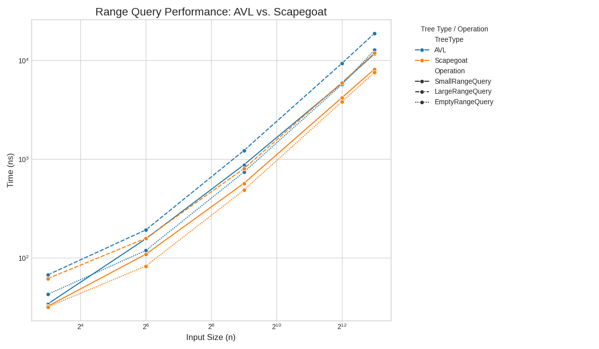
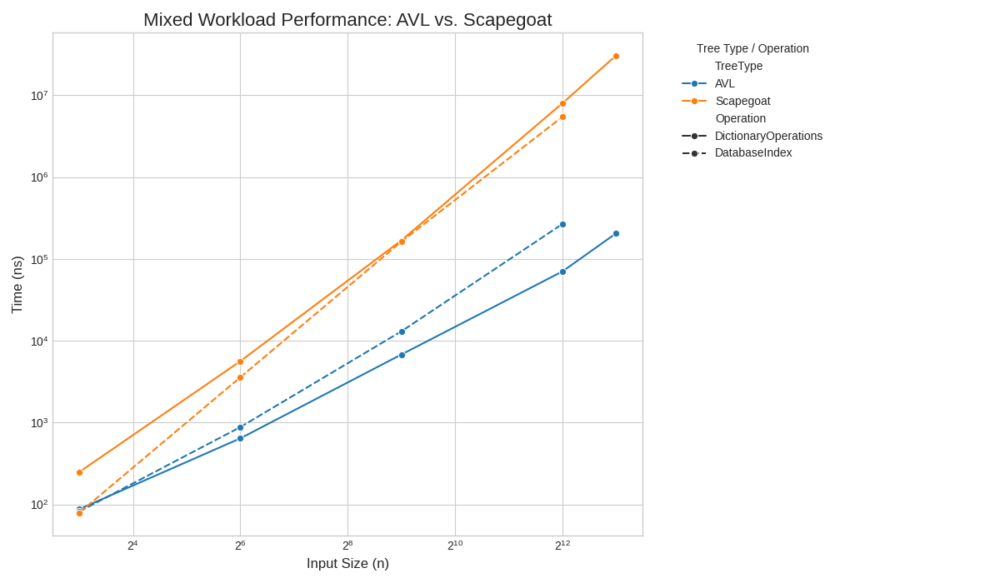
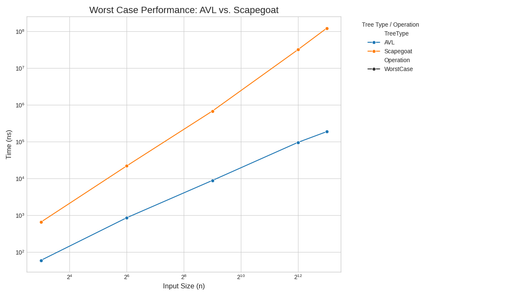
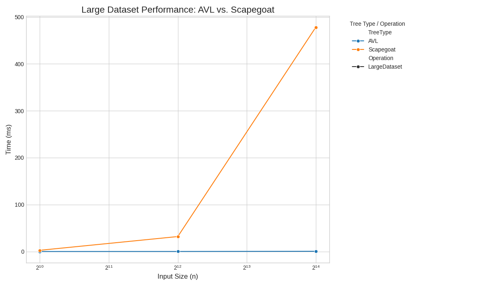
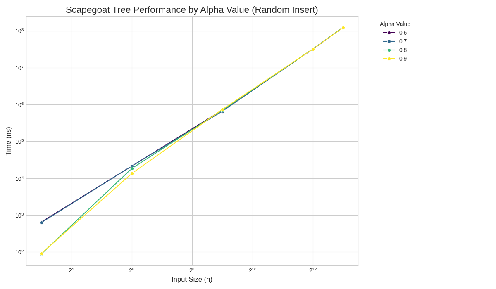

# Arbori AVL vs. Scapegoat

Acest document compară viteza arborilor AVL și Scapegoat folosind teste rulate cu biblioteca Google Benchmark. Testele includ operații de inserare, ștergere, căutare, căutări pe intervale (range queries), scenarii mixte și teste pentru cazul cel mai nefavorabil (worst-case).

## Comparația Performanței

### 1. Inserare

Testele au inclus inserare de date în ordine crescătoare, descrescătoare, aleatorie și mixte (secțiuni crescătoare/descrescătoare).

**Observații:**

*   **AVL sunt mai rapizi decât Scapegoat la toate tipurile de inserare.** Diferența este mare mai ales la inserarea în ordine crescătoare/descrescătoare.
*   Echilibrarea automată a AVL (prin rotații) funcționează bine la inserarea în ordine, păstrând complexitatea logaritmică.
*   Scapegoat are timpi de inserare mult mai mari, mai ales cu cât numărul de elemente este mai mare. Cauza este reconstrucția periodică, care se întâmplă când dezechilibrul depășește limita alpha.

### 2. Ștergere

Testele au inclus ștergere aleatorie, ștergere în ordine și un scenariu cu multe ștergeri dar și inserări (80% ștergeri, 20% inserări).

**Observații:**

*   În testul `DeleteHeavyWorkload` se observă că multe ștergeri cauzează reconstrucții dese, rezultând în performanță foarte slabă pentru Scapegoat față de AVL.

### 3. Căutare

Testele au inclus căutarea cheilor existente, a cheilor inexistente și căutarea într-o distribuție de date formată din 80% din chei într-un interval mic și 20% distribuite larg.

**Observații:**

*   Performanța este foarte similară atât pentru căutările cu succes, cât și pentru cele fără succes.

### 4. Interogări pe Interval (Range Query)

Testele au inclus căutări pe intervale mici (5% din chei), mari (50% din chei) și intervale care nu conțin nicio cheie.

**Observații:**

*   **Arborii Scapegoat tind să aibă performanțe ușor mai bune decât arborii AVL în range queries.** Acest lucru este valabil pentru intervale mici, mari și goale.
*   Ambii arbori sunt eficienți la range queries, dar structura mai compactă a Scapegoat (mai puțin strict echilibrată) ar putea ajuta, vizitând în medie mai puține noduri. Totuși, diferența e mică față de cea de la inserare/ștergere.

### 5. Workload Mixt

Testele au simulat scenarii reale:
*   `DictionaryOperations`: Mix de 25% inserări, 50% căutări (jumătate reușite, jumătate eșuate), 25% ștergeri.
*   `DatabaseIndex`: Mix de 10% inserări, 60% căutări (lookups), 30% căutări pe interval (range queries).

**Observații:**

*   **AVL sunt mult mai performanți decât Scapegoat în scenarii mixte cu multe inserări și ștergeri.**

### 6. Cazul Cel Mai Nefavorabil (Worst-Case)

*   AVL: Inserări continue în ordine sortată.
*   Scapegoat: Un tip de inserare care forțează cât mai multe reconstrucții.

**Observații:**

*   **AVL se descurcă bine în cazul cel mai rău (inserare în ordine)**, datorită vitezei logaritmice garantate prin rotații.
*   Inserarea worst-case pentru **Scapegoat cauzează performanță foarte slabă**, datorită costului mare al reconstrucției.

### 7. Performanța pe Seturi Mari de Date

**Observații:**

*   **AVL arată o scalabilitate mult mai bună cu multe date față de Scapegoat.** Timpul de inserare la AVL crește lent.
*   Timpul de inserare la Scapegoat crește foarte mult pentru N mare, confirmând că reconstrucția devine prea scumpă când arborele crește în aceste condiții.

### 8. Alpha Tuning

Testele au verificat viteza de inserare la Scapegoat cu diferite valori alpha (0.6, 0.7, 0.8, 0.9). Alpha stabilește cât dezechilibru este permis înainte de reconstrucție (alpha mic = toleranță mică = reconstrucții dese).

**Observații:**

*   Parametrul alpha influențează performanța Scapegoat. În aceste teste (inserare aleatorie), valorile alpha 0.8 și 0.9 par ușor mai performante decât valoarea implicită 0.7 sau cea mai strictă 0.6 pentru dimensiuni mai mari.
*   Chiar și cu tuning, **viteza de inserare la Scapegoat rămâne mult mai slabă decât la AVL**.

## Concluzie

Conform testelor, AVL sunt mai rapizi în scenarii cu multe **inserări și ștergeri**, mai ales cu date secvențiale, multe ștergeri, sau seturi mari de date.

Scapegoat oferă viteză bună la **căutare și căutări pe interval (range query)**, uneori fiind puțin mai rapizi ca AVL la range query. Totuși, viteza lor scade mult la inserări și ștergeri, mai ales când crește cantitatea de date sau în anumite scenarii dificile, din cauza costului reconstrucției.